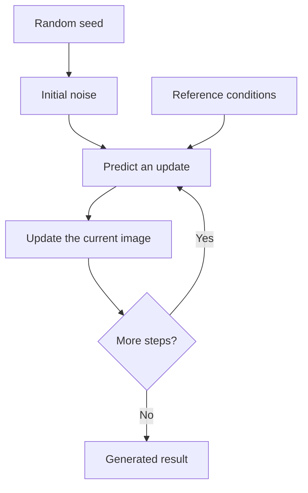

# Teaching diagrams

Choose stable Mermaid syntax supported by the destination. For GitHub Markdown, prefer `flowchart`, `sequenceDiagram`, `stateDiagram-v2` and `classDiagram`; verify other diagram types against the destination renderer before relying on them. See [Mermaid documentation](https://mermaid.js.org/intro/) and [GitHub diagram documentation](https://docs.github.com/en/get-started/writing-on-github/working-with-advanced-formatting/creating-diagrams).

## Authoring

- Use short ASCII node IDs and quoted labels in the learner's language.
- Explain arrow meaning: data flow, time, dependency or causation. A visual association is not evidence of causation.
- Keep inputs, processing and output distinguishable by labels, not color alone.
- Show training and inference separately when their inputs and available information differ.
- Label illustrative steps and unknown relationships. A diagram must not imply an implementation that the sources do not establish.
- Use the destination's default theme unless custom colors improve the explanation; inspect light and dark backgrounds if styling is added.
- Split a crowded diagram. Add a sentence below it that communicates the same essential relationship.

For example, this is an **illustrative** iterative generator, not a claim about any particular model:

The seed determines a starting sample. The model repeatedly uses the reference conditions to predict updates until the chosen steps finish. Conditions guide the prediction; this diagram does not assert that every generated detail is correct.

## Validation and delivery

Use an existing renderer or project command first. With Mermaid CLI available, extract the fence into a temporary `.mmd` file and run `mmdc -i diagram.mmd -o diagram.svg`. Review the resulting SVG for clipped labels, ambiguous arrows and unreadable contrast. Validate the exact source delivered, rather than a simplified stand-in.

GitHub Markdown should retain the fenced `mermaid` block. For a destination that does not render Mermaid, include a locally rendered SVG/PNG plus its source when possible. Use the existing HTML asset setup for an HTML lesson. Never upload private diagram content to an online editor just to validate it. Adding an exported image does not make syntax validation equivalent to visual review.
