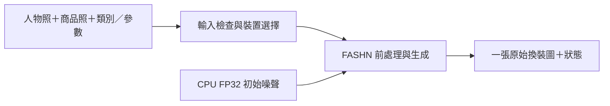

# fashn-vton-gradio｜本機 AI 試衣間

上傳人物照與商品照，在自己的電腦生成換裝預覽；同一個 Gradio 介面可選 CPU 或 NVIDIA GPU。適合想試用虛擬試穿、比較生成條件，或理解 AI 影像限制的人。

本專案把 **FASHN VTON 1.5** 整合為可安裝、可檢查的本機應用，保留單次原始生成結果；另外整理了一個「相同 Seed，為何裙子會變成褲子？」的控制變因案例與初學者教材。模型由 FASHN AI 提供，本地工作聚焦於介面、環境、裝置切換、取樣調整與驗證。

**現在可操作**：[安裝並試穿](#第一次換裝)；**不裝模型也可閱讀**：[控制變因報告](docs/space-controlled-diagnosis.md)及[生成模型圖解與小實驗](docs/model-learning-guide.md)。Repository 附兩張官方輸入範例；私人生成圖、操作截圖與實驗原始檔未隨 Git 提供。

## 從兩張照片到一張預覽


搭配[商品輸入範例](examples/garment.webp)即可進行第一次試穿；以上是輸入素材，不是本專案產生的結果。[圖片來源及使用界線](examples/SOURCES.md)保留上游版本與檔案雜湊。

- 支援上衣 `tops`、下身 `bottoms`、連身 `one-pieces`，以及模特兒穿著 `model`／平拍商品 `flat-lay`。
- 每次產生一張圖，可調 Steps、CFG、Seed 與 segmentation-free，直接顯示及下載模型輸出。
- CPU／GPU 在同一介面切換；同時只保留一份 pipeline，載入與推論互斥。GPU 不可用時明確報錯，需由使用者選擇 CPU。
- 安裝階段下載權重並記錄版本與雜湊；生成階段使用本機快取。預設只監聽 `127.0.0.1`，不開公開分享。

結果是穿搭風格預覽，無法量測合身程度或模擬真實布料受力；手指、臉、Logo、背景及未指定更換的衣物仍可能改變。目前沒有局部修補、候選挑選或自動重試功能。

## 第一次換裝

需要 Linux、Python 3.12、Git 與 [uv](https://docs.astral.sh/uv/)。首次安裝需連網下載套件與模型；GPU 路徑還需可用的 NVIDIA 驅動及足夠 VRAM，CPU 仍需數 GiB RAM，生成時間可能很長。完整環境與疑難排解見[操作手冊](docs/usage.md)。

```bash
git clone https://github.com/KarlSideProjects/fashn-vton-gradio.git
cd fashn-vton-gradio
bash scripts/setup.sh cuda
bash scripts/start.sh
```

只有 CPU 時，將安裝指令改為 `bash scripts/setup.sh cpu`；啟動後也要在介面把預設 GPU 改選 **CPU**。開啟 `http://127.0.0.1:7860`，選取兩張範例、`tops`／`model`，再按 **Try On**。

第一張維持 **30 steps、CFG 1.5、Seed 42、segmentation-free 開啟**。預期結果是可下載的換裝圖與含載入時間的狀態；第一次需額外載入模型。可用 `bash scripts/start.sh --port 7861` 更換連接埠。

[既有操作紀錄](docs/usage.md)記載同一組照片的單次含載入耗時：RTX 4060 Ti 約 47 秒，Ryzen 9 7945HX CPU 約 23 分 32 秒。這是歷史單例，非本輪重測、跨硬體基準或速度保證。

## 為什麼保留簡單的單次生成？



[app.py](app.py) 負責介面、輸入限制及 pipeline 管理。CPU 使用上游 `TryOnPipeline`；GPU 使用 [CpuNoisePipeline](tryon/sampling.py)，先在 CPU 產生 FP32 初始噪聲，再轉到 GPU 的推論格式，其餘沿用固定版本的 Euler／CFG 取樣流程。沒有重新訓練或修改模型權重；相同 Seed 也不保證跨裝置逐像素一致。

這個選擇源自[2026-09-15 控制變因紀錄](docs/space-controlled-diagnosis.md)：同一組人物／商品照、同一個 Seed，在保留條件圖與 GPU 運算時，改變初始噪聲來源便改變了花裙是否保留；保留原噪聲、只改 FP32 運算則未解決該案例。

這提供了可追查的診斷線索，不能證明 CPU 噪聲普遍較好。先前的手部／臉部貼回及局部重繪增加操作與失敗點，現行版本已移除；相關設計與驗證文件屬歷史紀錄。原始私人圖片和實驗 JSON 不在 repo，外部讀者可檢視方法與程式，無法僅靠 clone 重算該案例的全部數值。

### 環境也屬於重現條件

[requirements.txt](requirements.txt) 固定 FASHN 推論程式 commit 與主要套件版本；[download_models.py](scripts/download_models.py) 在首次下載時取得模型 revision，後續沿用本機 manifest 並記錄 SHA-256。因此固定程式版本不等於所有新安裝都使用同一版權重，分享實驗時也應記錄 `weights/manifest.json` 的版本資訊。

[config.py](tryon/config.py) 將模型、快取與暫存留在專案資料夾。這方便檢查與清理，但不等於不落地儲存照片；私人圖片、權重及 `outputs/` 不應加入 Git。

## 如何判斷驗證到哪裡？

| 證據 | 能確認的範圍 | 不能推論的事項 |
| --- | --- | --- |
| [App 測試](tests/test_app.py) | 參數檢查、一次推論、原圖回傳、裝置快取與互斥；模型邊界使用替身 | 真實照片生成品質 |
| [取樣測試](tests/test_sampling.py) | 有相應依賴／硬體時，比較上游 CPU 公式與多 Seed 噪聲轉換 | 多人物、多服裝品質改善 |
| [HTTP／佇列 smoke](scripts/smoke_ui.py) | 真實 Gradio 啟動、API、缺圖拒絕 | 瀏覽器上傳下載與 GPU 推論 |
| [CPU CI](.github/workflows/cpu-checks.yml) | UI 依賴環境下的單元、HTTP、Python／Shell 語法檢查 | GPU 推論；數值測試可能略過 |
| [歷史控制實驗](docs/space-controlled-diagnosis.md) | 單案例的噪聲、精度、遮罩比較方法與紀錄 | 未附私人原始檔的獨立重算、通用品質保證 |

2026-09-16 本輪在隔離的 Python 3.12／UI 依賴環境執行：11 項測試中 9 項通過、2 項因未安裝 Torch／FASHN 略過，HTTP／佇列 smoke 通過；未執行真實模型推論。

安裝完整環境後可執行：

```bash
.venv/bin/python -m unittest discover -s tests -v
.venv/bin/python -m scripts.smoke_ui --port 7862
.venv/bin/python -m scripts.check
.venv/bin/python -m scripts.smoke_inference --device cuda
```

最後一項才真正生成，CPU 可改為 `--device cpu`；會把 PNG 與 JSON 放在 `outputs/space-smoke/<id>/`。`check` 通過只代表環境／權重檢查，生成完成仍需人工檢視衣服一致性、人物保留、遮擋合理性和非目標區域。

## 從試用到 AI 素養

[初學者指南](docs/model-learning-guide.md)保留影像數值、訓練／推論、Noise／Seed、Flow Matching、Transformer、CFG 的圖解、自我檢核答案，以及一次只改一項的四個小實驗。

可以固定照片、模型版本與裝置，只改 Seed、Steps 或 CFG，先寫預測，再比較衣服、手部與背景。這能練習控制變因、分開判斷程式成功與成品品質，也能討論單例證據的推論界線。教材與活動設計已在 repo；尚無學習者樣本、課堂實施或教學成效證據。[理論來源筆記](docs/fashn-theory-sources.md)區分公開模型設計與教學用簡化公式。

## 來源、貢獻範圍與授權

本地入口改編自 [hemil124/virtual-tryon Space 的固定版本](https://huggingface.co/spaces/hemil124/virtual-tryon/tree/29f4ad42a29af63c71a7bc9e53ea7cd5342694c1)，模型及推論程式來自 [FASHN AI 的固定版本](https://github.com/fashn-AI/fashn-vton-1.5/tree/7c0f10af3f91ad4048fe9729c470a13ef905d25a)。本 repo 的成果是本機整合、裝置與資源管理、取樣差異診斷及教材整理，不能將上游架構、訓練資料或模型權重列為本地原創。

保留 Apache-2.0 [LICENSE](LICENSE)、[NOTICE](NOTICE) 及[範例來源](examples/SOURCES.md)。[官方模型卡](https://huggingface.co/fashn-ai/fashn-vton-1.5)列有模型及 DWPose／YOLOX／FASHN Human Parser 的來源與授權；第三方套件、模型與照片需依各自條件使用。本專案與 hemil124、FASHN AI 無隸屬或背書關係。
