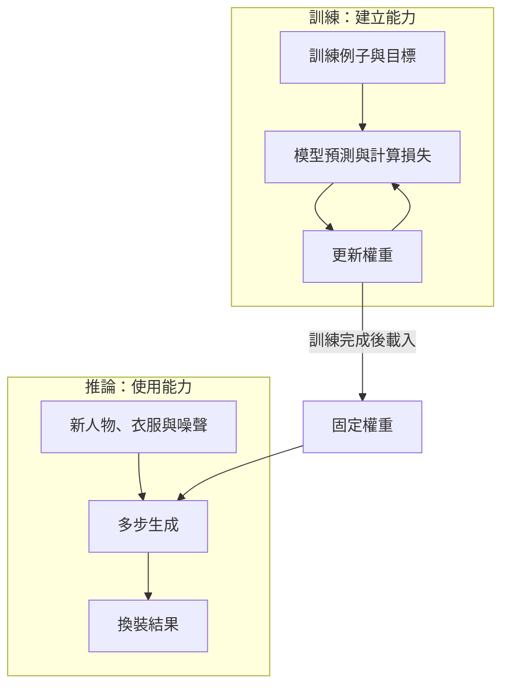
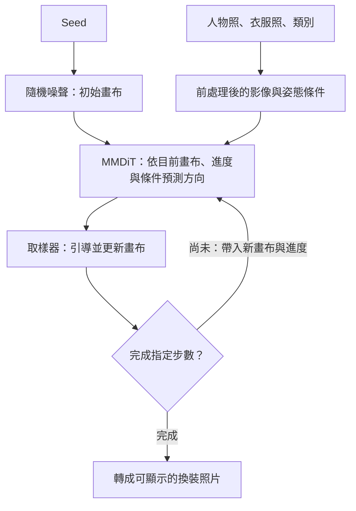
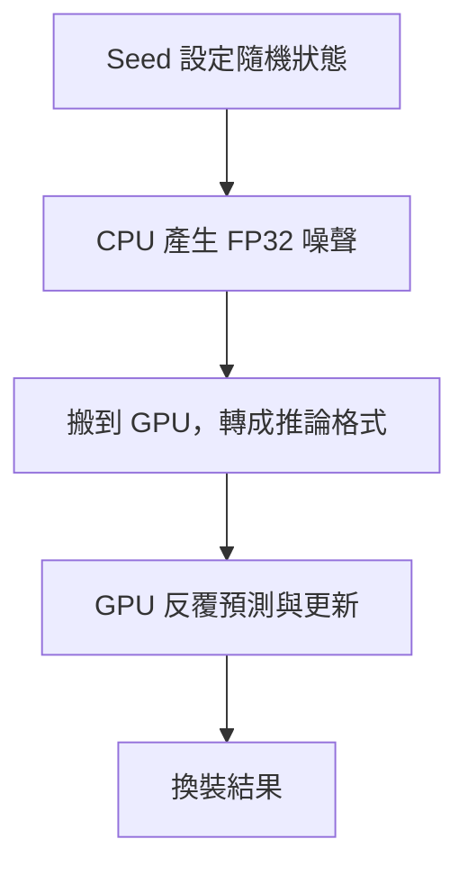

# 從 AI 換衣服認識生成模型：FASHN VTON 1.5 初學者指南

上傳一張人物照，再上傳一件衣服，按下按鈕，就能看到換裝結果。
看起來只是一個小功能，背後卻串起了影像表示、機器學習、姿態估計、Transformer、
隨機噪聲與數值計算。回到[專案首頁](../README.md)。這份文章以本專案使用的 **FASHN VTON 1.5** 為例，
從「它到底在做什麼」開始，不要求你先懂微積分或寫過 AI 程式。

先記住一句話：**模型不是把衣服貼上去，而是參考人物與商品照片，生成一張可能的換裝照片。**

這也解釋了它為什麼有時很自然，有時卻改動手指、裙子或背景：
「生成得像」和「每個不該改的地方都完全不動」，是兩個不同的要求。

## 怎麼使用這份教材

讀者只需要知道如何上傳照片，不需要先學微積分。第一次閱讀先抓住三個問題：
**模型參考什麼？每一步改什麼？結果有哪些不保證？**

| 學習階段 | 閱讀路線 | 讀完後試著做到 |
| --- | --- | --- |
| ① 理解生成 | [換裝任務](#一從一件長袖上衣開始) → [影像數值](#二電腦眼中的照片不是人而是一大堆數字) → [訓練與推論](#三訓練和生成是兩件不同的事) | 解釋為什麼換裝不是貼圖、按按鈕不是訓練 |
| ② 看懂參數 | [Noise 與 Seed](#四初始噪聲不是照片拍壞了) → [Flow 與 Steps](#五flow-matching學會每一步該怎麼改) → [Transformer](#六transformer如何同時看人物和衣服) → [遮罩](#七姿態分割與免遮罩三個不同概念) → [CFG](#八cfg讓條件影響更強不是把品質分數調高) | 分辨起點、預測網路、更新方法和條件強度 |
| ③ 動手驗證 | [CPU／GPU 案例](#九cpugpu-與精度為什麼同一張照片會不同) → [小實驗與自我檢核](#十用四個小實驗把理論變成直覺) → [修補的教訓](#十一為什麼這個-repo-拿掉了修補) | 設計一次只改一個變因的比較，不把單例當定律 |

想先操作，可直接做[第一次換裝](#十二快速開始)，再回來讀原理。
環境疑難排解與完整操作看[操作手冊](usage.md)；
想查論文與程式則看[延伸閱讀](#十三接下來怎麼讀原始碼與論文)。
文中的數值練習不需 GPU，也能先完成。

> 閱讀界線：本文會分開說明「通用理論」、「官方公開的 FASHN 設計」與「本 repo 的實測」。
> 白話比喻及教學公式不是 FASHN 完整訓練配方。理論來源筆記建立於 2026-09-15；
> 本次於 2026-09-16 複核官方架構說明與本 repo 取樣實作。全文討論固定的 1.5 版本，不泛指其他換裝模型。

## 一、從一件長袖上衣開始

假設人物照穿短袖，商品照是一件長袖。換裝不只是把藍色換成綠色：

- 袖子要沿著人物彎曲的手臂延伸。
- 原本露出的前臂，可能要被新袖子遮住。
- 胸前的手必須留在衣服前面，不能變成衣料上的圖案。
- 衣服皺褶、陰影與寬鬆程度，要配合人物姿勢。
- 新衣服遮住的地方與露出的地方，都可能和原照片不同。

這是「條件式影像生成」：模型有自由生成，但必須參考指定條件。
在這裡，條件包括人物圖、衣服圖、服裝類別與姿態資訊。
FASHN 公開的推論介面沒有自由輸入文字 prompt；`tops` 這種類別選項也不是自然語言提示詞。
見[固定版本的輸入與前處理程式](https://github.com/fashn-AI/fashn-vton-1.5/blob/7c0f10af3f91ad4048fe9729c470a13ef905d25a/src/fashn_vton/pipeline.py)。

你可以把它想成一位看著兩張參考照畫畫的人。但這只是比喻：
公開流程處理的是影像數值，並沒有建立你的精確身體尺寸、布料材質與受力模型。
因此，漂亮的試穿圖適合拿來預覽風格，**不能證明實際穿得下、袖長正確或布料真的這樣垂墜**。

## 二、電腦眼中的照片：不是人，而是一大堆數字

一般 RGB 照片的每個像素有三個數值，分別表示紅、綠、藍。
例如 `(255, 0, 0)` 是紅色，`(0, 0, 0)` 是黑色。
把所有像素排在一起，就是一個有高度、寬度與色彩通道的數字陣列。

你在程式裡看到的 **tensor（張量）**，先把它理解成「可以有多個維度的數字表格」就夠了。
一批圖片還會多出「這是第幾張圖」的維度。
深度學習框架常以「批次、通道、高度、寬度」排列，和人平常說的照片寬高順序不同。

FASHN 的模型畫布是**寬 576 × 高 864**。輸入會配合長寬比縮放、補邊，
生成後再去掉補邊，所以下載圖片不一定剛好是 576 × 864。
程式也會把 0–255 的色彩值換算到模型使用的 -1 到 1 範圍；
這叫正規化，目的是換一把計算用的尺，不是把照片修漂亮。
見[模型卡](https://huggingface.co/fashn-ai/fashn-vton-1.5)與[前處理實作](https://github.com/fashn-AI/fashn-vton-1.5/blob/7c0f10af3f91ad4048fe9729c470a13ef905d25a/src/fashn_vton/pipeline.py)。

這個尺寸也帶來直覺上的限制：全身照裡，手指可能只占少量像素。
原圖很大，不代表縮放後模型仍看得到同等細節；輸出再放大，也不會自動找回沒有生成好的指節。

### 「像素空間」和「潛在空間」差在哪裡？

有些生成模型先用 VAE，也就是一種學習式編碼／解碼器，把影像轉成較小的潛在表示，
在那個空間生成，最後再解碼回圖片。你可以暫時把它理解成「先用濃縮版資料工作」。

FASHN 1.5 則直接在 RGB 像素空間生成，不經過這一道 VAE 編碼與解碼。
但它內部仍會把影像轉成特徵向量；**沒有 VAE，不等於沒有中間表示，也不等於原圖一定完全保真**。
見[官方架構說明](https://fashn.ai/research/vton-1-5)。

## 三、訓練和生成，是兩件不同的事

「訓練」像練習解題：模型看很多例子，做預測，再根據預測與目標的差距調整內部數字。
這些可調整的數字叫 **參數或權重**；衡量差距的規則叫 **損失函數（loss）**。
最佳化器根據損失提供的訊號，一點一點更新權重。

「推論」則像拿已經練好的能力來作答。本專案按下 Try On 時，是載入權重進行推論，
不是重新訓練模型，也不是把你的照片加入下一輪訓練。

FASHN 官方列出的規模是約 **9.72 億個參數**。
這不是 9.72 億張照片，也不是輸出像素數，而是模型中可學習數值的數量。
見[官方模型卡](https://huggingface.co/fashn-ai/fashn-vton-1.5)。

下面的箭頭表示資料如何被使用。注意：**只有訓練那一邊會修改權重**。
這是概念圖，不是作者完整的訓練配方。



生成步數再多，也是反覆使用同一套權重做預測；不是邊生成邊重新學習。

### 它怎麼學會「換衣服，但保留這個人」？

<details>
<summary>進一步理解：作者公布的兩階段訓練（初讀可略過資料規模）</summary>

作者公布了兩階段訓練概要：先用約 1,800 萬組遮罩配對訓練，
再以各半比例混合遮罩配對與約 400 萬組合成三元組。
合成資料利用第一階段模型產生替代穿搭，再以原照片作為目標，建立後續學習例子。
作者也說明了訓練時最多丟棄 75% tokens 的效率設計。
這是訓練策略，**不是生成時隨機刪掉你照片的 75%**。
見[作者的訓練說明](https://fashn.ai/research/vton-1-5)。

這裡值得學的是：能力不只由「用了哪種神經網路」決定，也受資料如何配對影響。
如果學習例子能教它「原本穿 A，現在要穿 B」，模型才有機會學習區分人物與衣服。
但合成例子也可能含有瑕疵；作者把這點列為身形保留仍有限制的原因之一。

官方公開了架構、權重與推論程式，也說明了上述資料策略；
這仍不等於提供了一份可以完整重做訓練的食譜。以下理論公式用來理解原理，
不把其他論文的全部設定冒充為 FASHN 已確認的訓練細節。

</details>

## 四、初始噪聲，不是照片拍壞了

生活中的「雜訊」常指夜拍照片的顆粒。但這裡的**初始噪聲（initial noise）**，
是程式主動產生的一整張隨機數值陣列，是生成結果的起點。

在本模型的流程中，人物照與衣服照另外作為參考條件；
待生成的畫布則從隨機數字開始，不是直接把人物原圖當作這張初始畫布。

這張圖回答「人物照和噪聲是不是同一個輸入？」箭頭代表資料流，
回圈代表反覆更新畫布；前處理細節暫時合併成一格。



人物和衣服一直是參考條件，噪聲才是待生成畫布的起點；
條件會影響結果，但不是把原照片每個像素鎖住。

固定版本用 `torch.randn` 產生高斯噪聲：大多數數值靠近 0，較大的正負值比較少。
它們還不是能直接當成普通照片顯示的 0–255 色彩值。
見[上游取樣程式](https://github.com/fashn-AI/fashn-vton-1.5/blob/7c0f10af3f91ad4048fe9729c470a13ef905d25a/src/fashn_vton/pipeline.py)。

為什麼需要隨機起點？因為「這個人穿上這件衣服」並沒有唯一的像素答案。
皺褶、陰影與被遮住的細節，都可能有多種合理畫法。
噪聲提供不同的生成起點；模型的學習結果和參考條件，則讓生成不只是胡亂畫圖。

### Seed 是什麼？

**Seed（隨機種子）**是設定偽隨機數產生器起始狀態的數字。
可以把它想成洗牌機的起始設定：

- 相同機器、相同設定與相同操作順序，才有機會重做同一副牌。
- Seed 從 42 改成 43，是換一個起點，不是把品質提高一級。
- 換一種洗牌機，即使輸入 42，也不保證牌序相同。

最後一點正是 CPU 與 GPU 的常見陷阱。
**相同 Seed 不保證跨裝置、跨版本得到相同噪聲或相同成品。**
即使固定了噪聲，浮點運算與某些演算法的非確定性，也可能影響重現性。
見[PyTorch 2.8 的重現性說明](https://docs.pytorch.org/docs/2.8/notes/randomness.html)。

## 五、Flow Matching：學會每一步該怎麼改

現在最大的問題是：一堆隨機數字，怎麼變成穿衣服的人？

先不用想「它一次看穿最後答案」。可以把生成過程理解成：
模型看到目前畫布、進度與參考條件，提出每個數值應該如何改變；
程式照著修改一小步，再把新畫布交回模型，如此反覆。

這個「在目前位置，應該往哪個方向、以多快速度改變」的規則，叫**向量場**。
對圖片而言，方向是大量像素數值的變化方向，
不是袖子在真實空間移動的方向，更不是布料受力模擬。

**Flow Matching** 是學習這類向量場的訓練框架。
它可以搭配不同路徑；不能簡化成「所有 Flow Matching 都一定走直線」。
見[Flow Matching 原論文 §2–4](https://arxiv.org/html/2210.02747v2#S2)。

### Rectified Flow 的直覺：先造出能練習的中間狀態

用一個簡化的直線插值例子理解。
訓練時，我們已經有一張目標照片，也能隨機產生一張噪聲。
把兩者按比例混合，就能做出不同進度的練習題：

先只看一個數值：假設噪聲是 `−0.4`，目標值是 `0.8`，
走到一半時是 `0.5 × (−0.4) + 0.5 × 0.8 = 0.2`。
兩端差距是 `0.8 − (−0.4) = 1.2`；它是這個教學例子裡的目標速度。
整張圖片只是把相同運算同時套用到很多數值。

```text
t = 0       全部是噪聲
t = 0.5     一半噪聲數值 + 一半目標照片數值
t = 1       全部是目標照片數值

中間狀態 xₜ = (1 − t) × 噪聲 z + t × 目標照片 x
這條直線的目標速度 = x − z
```

這裡的加減是對每個數值計算；`t` 是 0 到 1 的生成進度，不是現實經過幾秒。
因為訓練時知道兩端，所以可以算出「希望模型預測的方向」，讓模型拿來練習。
這是理解 Rectified Flow 的入口。
見[Rectified Flow 原論文 §2.1](https://arxiv.org/html/2209.03003v1#S2.E1)。

**真正生成時沒有目標完成圖可以偷看。** 模型要靠訓練得到的權重，
參考人物與衣服，自己預測當下方向。
訓練例子的插值是直線，也不代表學到的每一條生成軌跡完全筆直，
更不表示一定能一步完成。上述公式是教學例子，不是 FASHN 完整訓練損失的宣稱。

### Steps：走幾小步，不是重新學幾次

本版本使用 Rectified Flow 的時間排程與 Euler 更新。
Euler 可以理解成：「依照目前方向，先走一小段，再重新問方向。」

```text
下一步畫布 = 目前畫布 + 這一步的進度間隔 × 模型預測方向
```

假設只看其中一個數值：目前是 0.2，方向是 0.5，進度間隔是 0.1，
下一步就是 `0.2 + 0.1 × 0.5 = 0.25`。實際上會同時更新整張畫布的數值。

介面的 **30 steps** 是做 30 次這種數值更新，不是訓練 30 次，也不是先產生 30 張候選圖。
實際時間排程會調整間隔，不能假設每一步都恰好走 1/30。
更多步可能讓數值近似更細，但不能補足模型沒學好的知識，因此不保證手指更正確。
見[RF 時間排程](https://github.com/fashn-AI/fashn-vton-1.5/blob/7c0f10af3f91ad4048fe9729c470a13ef905d25a/src/fashn_vton/utils/sampling.py)
與本 repo 的[取樣實作](../tryon/sampling.py)。

### 這和常聽到的 Diffusion 有什麼關係？

擴散模型與流模型都能把簡單噪聲分布轉成複雜的影像分布，
但訓練路徑、預測目標與生成方程不一定相同。
不要只因為都有多步生成，就把 FASHN 寫成「使用傳統 DDPM 去噪公式」。
也不要因為下一節的架構名稱含有 Diffusion，就推斷它一定使用 VAE。
生成方法和神經網路架構，需要分開看。
見[Flow Matching 的路徑討論](https://arxiv.org/html/2210.02747v2#S4)。

## 六、Transformer：如何同時看人物和衣服？

前一節解釋「每一步要預測方向」，這一節回答「用什麼網路來預測」。

Transformer 是處理一串特徵向量的神經網路架構。
語言模型可以處理文字 tokens；影像模型也能把圖片切成小區塊，
將每塊轉成一串數字，作為 **token**。
它不是把衣服剪下來拼貼，而是把影像換成方便計算的特徵表示。

FASHN 使用 12 × 12 像素的 **patch（小區塊）**。
以 576 × 864 畫布計算，空間格子是 48 × 72，也就是 3,456 個位置。
這是理解一個影像串流如何切塊的算術，不是整個網路所有 tokens 的總數。
見[模型規格](https://huggingface.co/fashn-ai/fashn-vton-1.5)。

**Attention（注意力）**讓某個位置的特徵能參考其他位置的特徵。
想像胸前區塊需要同時參考肩膀姿勢、袖子的走向與商品的顏色；
這比每個小區塊只看自己更有機會形成協調的整體。
位置資訊則協助網路區分上下左右，避免小卡片變成一袋沒有位置的碎片。
這是理解影像 Transformer 的比喻，不是模型真的懂人體力學。
見[DiT 原論文 §3.2](https://arxiv.org/html/2212.09748v2#S3.SS2)。

### MMDiT 是什麼？

**MMDiT** 是多模態 Diffusion Transformer 架構名稱。
你可以把「多模態」理解成不同來源的資訊需要互相交流，
而不是固定等於「一定有文字聊天功能」。

SD3 論文中的 MMDiT 主要讓文字與影像資訊交流；
**FASHN 的實作則處理人物／待生成畫布與服裝影像資訊**，
不能照搬 SD3 的文字編碼器與 VAE 流程。
見[MMDiT 原論文 §4](https://arxiv.org/html/2403.03206v1#S4)
及[FASHN 網路實作](https://github.com/fashn-AI/fashn-vton-1.5/blob/7c0f10af3f91ad4048fe9729c470a13ef905d25a/src/fashn_vton/tryon_mmdit.py)。

不用一開始就背完每層尺寸。用三個不同問題來整理它們：

| 問題 | 名稱 | 白話工作 |
| --- | --- | --- |
| 誰負責預測？ | Transformer／MMDiT | 把目前畫布和條件變成更新方向 |
| 怎麼學會預測？ | Flow Matching／Rectified Flow | 建立學習向量場的訓練問題；完整 FASHN 配方仍有未公開部分 |
| 怎麼照預測前進？ | Euler sampler | 把方向乘上步長，再加到目前數值 |

## 七、姿態、分割與免遮罩：三個不同概念

**姿態估計（pose estimation）**回答「身體各部位大致在哪裡、如何擺放」。
本流程使用 DWPose，並把姿態轉成影像條件。
它像提供骨架參考，不是保證輸出每根手指正確的解剖檢查器。

**人物解析／語意分割（human parsing）**回答「哪些像素屬於哪個部位或服裝類別」。
例如區分上衣、手臂和下身，方便後續準備輸入。
姿態比較接近位置關係；分割比較接近區域標籤。
見[上游前處理流程](https://github.com/fashn-AI/fashn-vton-1.5/blob/7c0f10af3f91ad4048fe9729c470a13ef905d25a/src/fashn_vton/pipeline.py)。

**Mask（遮罩）**則是用來指定區域的圖。
傳統換裝方法常先遮掉人物的舊衣服，讓模型補出新衣服。
遮得太窄可能限制寬鬆新衣；遮得太廣又可能拿走手部或身形線索。

FASHN 的 **segmentation-free／maskless** 預設，
是讓人物參考圖不先遮掉舊衣服，讓模型自己學習替換。
**它不代表整個 pipeline 完全不跑分割模型。**
固定版本仍會做人像解析；商品是模特兒照時，也會利用服裝區域準備參考圖。
平拍商品則走不同處理，因此 `model` 和 `flat-lay` 應依照片內容選擇。
見[遮罩與服裝輸入實作](https://github.com/fashn-AI/fashn-vton-1.5/blob/7c0f10af3f91ad4048fe9729c470a13ef905d25a/src/fashn_vton/preprocessing/agnostic.py)。

還有一個重要差別：**提供遮罩作為生成條件，不等於最後強制只改遮罩內像素。**
在這個版本，關掉 segmentation-free 並不會自動變成「背景與手部絕對鎖住」模式。

所以，換上衣卻改到裙子，不能只靠選了 `tops` 就認定不可能發生。
類別是模型的參考條件，不是輸出圖片上不可越界的硬性邊界。

## 八、CFG：讓條件影響更強，不是把品質分數調高

**CFG（Classifier-Free Guidance）**可以理解成：
比較「有換裝條件時的預測」與「拿掉條件時的預測」，
再加強兩者之間的差異，讓生成更受指定條件影響。

本版本的取樣公式可寫成：

```text
引導方向 = 無條件方向 + CFG × (有條件方向 − 無條件方向)
```

這裡的「方向」就是前面介紹的畫布數值變化方向。
不需要另外安裝一個判斷衣服的 classifier；
網路本身會產生這兩路預測。
程式預設最後一步直接使用有條件方向，其餘步驟套用引導。
見[網路的 forward_for_cfg](https://github.com/fashn-AI/fashn-vton-1.5/blob/7c0f10af3f91ad4048fe9729c470a13ef905d25a/src/fashn_vton/tryon_mmdit.py)
與[本 repo 取樣器](../tryon/sampling.py)。

在上述公式中，CFG = 1 時就是有條件方向；1.5 則再向條件差異的方向推一些。
例如無條件方向是 `0.2`、有條件方向是 `0.6`，CFG 1.5 得到
`0.2 + 1.5 × (0.6 − 0.2) = 0.8`。這是**引導方向**，不是最後像素值；
還要交給前面介紹的 Euler 更新。
但條件方向也是模型的預測，不是標準答案。
把 CFG 調大不會自動變成更正確的手、更準的 Logo 或更自然的皺褶。
本介面沿用 1.5 作為預設，先建立基準，再小幅比較即可。

## 九、CPU、GPU 與精度：為什麼同一張照片會不同？

CPU 和 GPU 都是在計算神經網路的數值。
GPU 擅長大量平行運算，通常能大幅縮短這類推論時間；
它不會因為是 GPU 就「比較沒有審美」。

還要分清 **FP32** 與 **BF16**：它們是儲存與計算浮點數的格式。
FP32 用 32 位元，BF16 用 16 位元；BF16 的數值精細程度較低，但能節省空間，
在支援的 GPU 上適合高效率運算。
這不是照片的 JPEG 壓縮率，也不是把成品套一層模糊濾鏡。

本專案 CPU 使用 FP32；GPU 在硬體支援時依上游設定使用 BF16。
此外，**GPU 模式會先在 CPU 以 FP32 產生初始噪聲，再搬到 GPU 並轉成推論格式**。
大部分生成運算仍由 GPU 完成，沒有加入額外修圖模型。
可對照[裝置選擇](../app.py)及[噪聲與取樣](../tryon/sampling.py)。

下面顯示**本 repo 目前 GPU 路徑**的資料搬移，不是所有模型的通則：



因此「CPU 產生噪聲」不等於「整個模型都跑在 CPU」。
同一個 Seed 換了噪聲產生裝置，可能換掉起點；
即使起點統一，後續數值運算也不保證跨裝置完全一致。

### 我們的裙子變褲子案例，教會了什麼？

曾有同一組照片：對方結果保留花裙，我方卻變成深色褲裝。
一開始很容易猜「是不是 GPU 不好」或「一定要事後修圖」。
但控制變因實驗發現：

1. 不做任何後處理，仍能逐像素重現問題圖。
2. 保持條件圖與 GPU／BF16 運算，只換成 CPU 產生的初始噪聲，這次便保留花裙。
3. 保留原本噪聲，只把運算改成 FP32，這次仍然失敗。

這支持「**這一個案例主要受噪聲起點影響**」，而不是「GPU 普遍比較差」。
但它也沒有證明 CPU 噪聲對所有照片都比較好：
只是一組照片、一個 Seed 的控制實驗，不能推廣成通用品質定律。
完整證據見[控制變因報告](space-controlled-diagnosis.md)。

即使統一噪聲來源，裝置、精度與其他運算仍有差異，
所以本專案不承諾 CPU／GPU 的成品逐像素一致。
把 BF16 權重轉成 FP32，也不會憑空恢復權重檔裡原本沒有的精度。

## 十、用四個小實驗，把理論變成直覺

先選有權使用的人物照與商品照，正確選擇類別和商品照片類型。
建立一張基準：**30 steps、CFG 1.5、Seed 42、segmentation-free 開啟**。
每次保存圖片，自己記下照片、參數、裝置與版本；
目前介面不會自動替你整理這份實驗紀錄。

不需要一次跑很多圖。GPU 可以先做下面的小比較；CPU 很慢時，挑一個實驗即可。

### 先預測，再看答案：四題自我檢核

1. 把 30 steps 改成 40，是讓模型再訓練 10 次嗎？
2. 目前數值 `0.2`，方向 `0.5`，步長 `0.1`，下一步是多少？
3. CPU 和 GPU 都用 Seed 42，是否一定生成同一張圖？
4. 圖 A 用 Seed 42／20 步；圖 B 用 Seed 43／40 步。B 比較自然，能證明增加步數有用嗎？

<details>
<summary>展開答案與理由</summary>

1. 不是。只增加推論的更新次數，權重不變。
2. `0.2 + 0.1 × 0.5 = 0.25`。方向不是要直接替換進去的最終像素值。
3. 不一定。Seed 只是隨機產生器的起始設定；裝置、版本和後續計算也影響結果。
4. 不能。Seed 和步數一起改了，無法分辨原因。先固定 Seed 比步數，再用其他照片與 Seed 複驗。

</details>

實作時可複製以下紀錄表。手部或非目標區域哪裡變差，寫出位置與現象，
比只填「好看／不好看」更容易回頭判斷。

| 項目 | 基準 A | 比較 B |
| --- | --- | --- |
| 人物／衣服檔名、模型與程式版本 | 自行填寫 | 保持相同 |
| 裝置、類別、照片類型 | 自行填寫 | 保持相同 |
| Seed／Steps／CFG／segmentation-free | 42／30／1.5／開啟 | 只改一項 |
| 衣服、人物、手部、背景觀察 | 自行填寫 | 自行填寫 |
| 耗時與輸出檔名 | 自行填寫 | 自行填寫 |

### 實驗 A：只改 Seed

保留其他設定，比較 Seed 42 與 43。

看皺褶、袖口、手指和背景是否改變。
如果某個 Seed 成功、另一個失敗，你學到的是「模型對生成起點敏感」，
不是成功的 Seed 從此適用所有人。
同設定重跑可用來檢查重現性，但不要把跨機器一致當成理所當然。

### 實驗 B：只改 Steps

固定 Seed 與裝置，比較 20、30、40 步。

看看增加時間後，細節是否真的更合理。
如果手指仍然錯，代表「走得更細」不一定能修正模型給出的方向。
也不要把 40 步的成功圖，和不同 Seed 的 20 步失敗圖相比，便認定是步數的功勞。

### 實驗 C：只改 CFG

固定其他設定，比較 1.0、1.5、2.0。

同時看商品特徵與人物自然程度，不只看衣服顏色。
如果衣服更像商品，但手或背景變差，就記錄這項代價；
單一「更聽條件」的旋鈕不能代表所有面向都改善。

### 實驗 D：只切換 segmentation-free

比較人物原衣服不遮罩、以及先遮罩的結果。

觀察新衣服的體積、原衣殘留、袖口與手臂。
這能幫助理解遮罩是如何影響輸入資訊，而不是預設關掉就比較安全。
不同服裝轉換可能有不同結果，需要多個案例才能評估策略。

### 成功不是「程式沒有報錯」

檢查成品時，至少分開看這幾件事：

- **服裝一致性**：顏色、領口、袖長、圖案是否符合商品？
- **人物保留**：臉、身形、姿勢是否被不必要地改變？
- **局部合理性**：手指、袖口與遮擋前後關係是否說得通？
- **非目標區域**：褲裙、背景與手持物有沒有被改掉？

一個平均像素差分數，可能被大片沒變的背景主導，卻漏掉小小的手部錯誤。
「和另一張成品很像」也不等於「和真實試穿一樣」。
這是影像生成評估最值得先建立的習慣。

## 十一、為什麼這個 repo 拿掉了修補？

我們曾加入手部／臉部貼回、幾何門檻、自動重試與局部重繪。
它們增加了操作和失敗點；袖口關係不確定時，甚至會整張拒絕輸出。
但後來的實驗才釐清，上述案例的主要差異其實在原始生成的噪聲起點。

**局部重繪（inpainting）本身不是沒有用。** 它是指定某個區域重新生成，
但要另外回答：哪裡錯了、該改多大、參考什麼、怎麼避免接縫、如何確認真的修好。
把原手貼回也不一定正確：新長袖可能本來就應該蓋住一部分前臂。

目前的選擇是保留來源 Space 的單次生成主流程，
移除自製修補、攔截與自動重試；GPU 只有前述噪聲來源調整。
這不表示模型已沒有瑕疵，而是先讓基準容易理解和驗證。
歷史細節見[失敗經驗與操作紀錄](usage.md)。

這個教訓不只適用換裝：
**先確認問題在哪一層，再決定要改輸入、取樣、模型，還是後處理。**
一張成功圖是線索；多組照片、固定變因與可重現結果，才足以支持更一般的結論。

## 十二、快速開始

本機需要 Linux、Python 3.12、Git 與 [uv](https://docs.astral.sh/uv/)。
首次安裝會下載套件與模型權重；GPU 模式需可用的 NVIDIA 驅動。
模型會占用數 GiB 記憶體，CPU 模式也不是不需要 RAM。

```bash
bash scripts/setup.sh cuda
bash scripts/start.sh
```

只有 CPU 的電腦，把第一行換成 `bash scripts/setup.sh cpu`。
CUDA 版安裝完成後可在同一個介面切換 GPU／CPU，不必建立兩個服務。

開啟 `http://127.0.0.1:7860` ，放入人物與商品照，
選 `tops`（上衣）、`bottoms`（下身）或 `one-pieces`（連身）。
商品由模特兒穿著時選 `model`，平拍商品選 `flat-lay`；
選好推論裝置後按 **Try On**。

第一次先不調參數：使用 30 steps、CFG 1.5、Seed 42、segmentation-free 開啟。
**預期完成條件**是介面顯示可下載的換裝圖；再用第十節的四個面向檢查品質。
能輸出不等於衣服與手部一定正確。若 GPU 不可用，可在介面選 CPU；
缺權重、記憶體不足或啟動失敗，先依[操作手冊](usage.md)檢查環境，不要把環境錯誤當成模型畫不好。

目前介面是 **Gradio 6.13.0**。Gradio 負責上傳、按鈕、排隊與結果顯示，
不是生成模型；單純升級介面，不會讓模型突然更懂手指或衣料。

本機單次實測，30 步含載入約為 GPU 47 秒、CPU 23 分 32 秒，
分別使用 RTX 4060 Ti 與 Ryzen 9 7945HX。
這不是正式跨硬體效能基準，也不保證你的等待時間相同。
升級既有環境、模型版本、測試指令與完整限制，請看[操作手冊](usage.md)。

生成期間在本機離線執行，預設只綁定 `127.0.0.1`，不開公開分享。
圖片快取、私人照片、權重與舊輸出不要加入 Git。
若自行修改對外連線設定，需另外處理存取控制與隱私風險。

## 十三、接下來怎麼讀原始碼與論文？

讀程式時，可以照資料流看，不需要從每個檔案第一行開始：

| 想回答的問題 | 閱讀位置 |
| --- | --- |
| 按按鈕後，參數如何傳給模型？ | [app.py](../app.py) 的 `try_on` |
| CPU／GPU 使用哪個 pipeline？ | [app.py](../app.py) 的 `get_pipeline` |
| 初始噪聲與每步更新在哪裡？ | [tryon/sampling.py](../tryon/sampling.py) 的 `_sample` |
| 上游如何做姿態、分割與輸入準備？ | [固定版本 pipeline.py](https://github.com/fashn-AI/fashn-vton-1.5/blob/7c0f10af3f91ad4048fe9729c470a13ef905d25a/src/fashn_vton/pipeline.py) |
| Transformer 如何接收人物和衣服？ | [固定版本 tryon_mmdit.py](https://github.com/fashn-AI/fashn-vton-1.5/blob/7c0f10af3f91ad4048fe9729c470a13ef905d25a/src/fashn_vton/tryon_mmdit.py) |

讀論文則建議依序：

1. [FASHN 官方專案頁](https://fashn.ai/research/vton-1-5)：先確認要解決的問題、架構與限制。
2. [Flow Matching for Generative Modeling](https://arxiv.org/abs/2210.02747)：理解向量場與生成路徑。
3. [Flow Straight and Fast / Rectified Flow](https://arxiv.org/abs/2209.03003)：理解直線插值與速度學習。
4. [Scalable Diffusion Models with Transformers / DiT](https://arxiv.org/abs/2212.09748)：理解圖片如何成為 tokens。
5. [Scaling Rectified Flow Transformers / MMDiT](https://arxiv.org/abs/2403.03206)：理解多種條件如何交流。

第一次讀可以只看摘要、架構圖與結論；回來用自己的話回答：
「輸入是什麼？網路預測什麼？下一步怎麼算？哪些地方沒有保證？」
能說清楚這四件事，就已經比只記模型名稱或調高參數更接近理解原理。

需要查證理論與 FASHN 實作的界線，可看[理論來源筆記](fashn-theory-sources.md)。

## 這份教材如何維護

Repo 已安裝 [teaching-with-diagrams](../.agents/skills/teaching-with-diagrams/SKILL.md)，
來源固定為 [CloudWorkTools/skills 的 5538aa5](https://github.com/CloudWorkTools/skills/tree/5538aa53a3beacd148709f9eb31dddd5ff92f948/skills/teaching-with-diagrams)。
這是寫教材的 agent 指引，不是模型的推論依賴，也不會改變生成結果。
後續可要求：「用 `$teaching-with-diagrams` 更新這份教材，先核對程式，再更新圖解與附答案的練習。」

三個原始技能的更新通知在 CloudWorkTools repo 處理；此處安裝的是固定副本，
不會因上游開 PR 就自動變更。更新副本時應保留本地修改並重新審查差異。

## 來源與授權

本機入口改編自 [hemil124/virtual-tryon Space](https://huggingface.co/spaces/hemil124/virtual-tryon/tree/29f4ad42a29af63c71a7bc9e53ea7cd5342694c1)，
使用 [FASHN AI 的 FASHN VTON 1.5](https://github.com/fashn-AI/fashn-vton-1.5/tree/7c0f10af3f91ad4048fe9729c470a13ef905d25a)。
固定來源與必要的本機修改詳見[操作手冊](usage.md)及 [NOTICE](../NOTICE)。

保留 Apache-2.0 [LICENSE](../LICENSE)；模型與相依套件沿用各自授權。
本專案與 hemil124、FASHN AI 沒有隸屬或背書關係。
